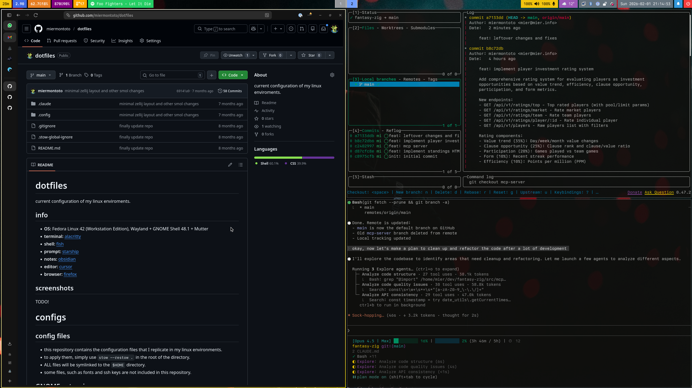

# dotfiles

    

current configuration of my linux enviroments.

## info

- **OS:** fedora 42 + hyprland
- **terminal:** [alacritty](https://alacritty.org/)
  - **shell:** [fish](https://fishshell.com/)
  - **prompt:** [starship](https://starship.rs/)
  - **other tools:** a[atuin](https://github.com/atuinsh/atuin), [zoxide](https://github.com/ajeetdsouza/zoxide), [claude](https://www.anthropic.com/claude-code)
- **notes:** [obsidian](https://obsidian.md/)
- **IDE:** [zed](https://zed.dev/)
- **browser:** [zen](https://zen-browser.app)

## how to

- this repository contains the configuration files that I replicate in my linux environments.
- to apply them, simply use `stow --restow .` in the root of the directory.
- ALL files will be symlinked to the `$HOME` directory.
- some files, such as fonts and ssh keys are not included in this repository.
